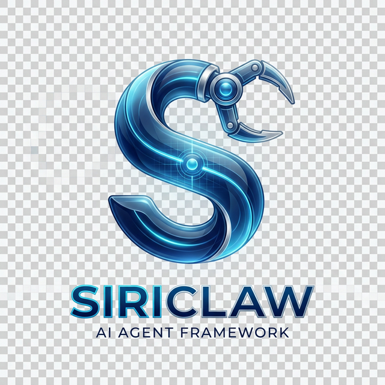
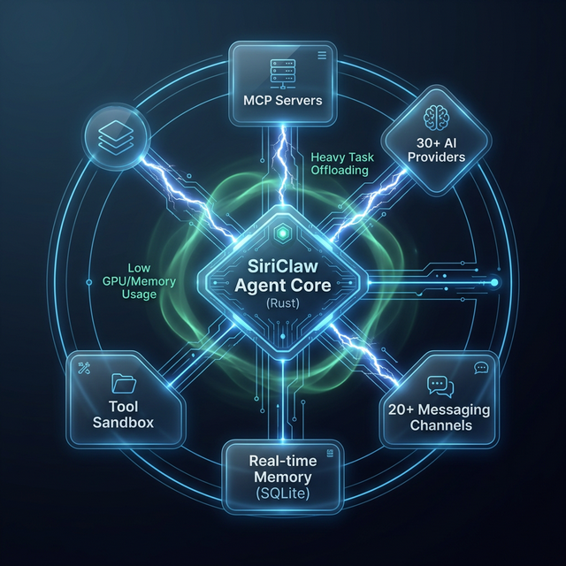
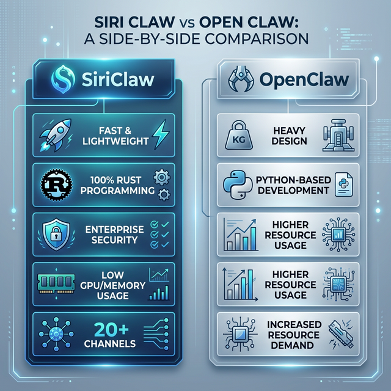

<p align="center">
  
</p>

<h1 align="center">SiriClaw ⚡</h1>

<p align="center">
  <strong>Zero overhead · Zero compromise · 100% Rust · Runs on any hardware with &lt;5MB RAM</strong><br/>
  <em>The production-grade AI agent runtime — 99% less memory than OpenClaw</em>
</p>

<p align="center">
  <a href="https://github.com/Sirius6907/siriclaw/actions"></a>
  <a href="LICENSE-MIT"></a>
  <a href="https://github.com/Sirius6907/siriclaw"></a>
  <a href="https://github.com/Sirius6907/siriclaw/stargazers"></a>
  <a href="https://github.com/Sirius6907/siriclaw"></a>
</p>

> **🚀 Live Prototype:** [**Public Web UI Demo (GitHub Pages)**](https://Sirius6907.github.io/siriclaw/) • Or clone → `cargo install --path .` → `sirius onboard --force` → `sirius daemon` → Open **http://localhost:5555** — fully functional self-hosted AI agent runtime in under 2 minutes.

<p align="center">
  🌐 <a href="README.md">English</a> · <a href="README.hi.md">हिन्दी</a> · <a href="README.hinglish.md">Hinglish</a>
</p>

<p align="center">
  <a href="#-quick-start">Quick Start</a> •
  <a href="#-total-onboard---single-command-setup">Total Onboard</a> •
  <a href="#%EF%B8%8F-architecture">Architecture</a> •
  <a href="#-cli-reference">CLI Reference</a> •
  <a href="#-troubleshooting">Troubleshoot</a>
</p>

---

## 🚀 Quick Start

### Prerequisites
- **Rust** 1.75+ with `cargo` ([Install](https://rustup.rs))
- **Node.js** 18+ for Web UI (`npm`)

### 1. Clone & Build
```bash
git clone https://github.com/Sirius6907/siriclaw.git
cd siriclaw
cargo install --path .
```

### 2. One-Command Onboard
```bash
sirius onboard --provider anthropic --model claude-3-5-sonnet --api-key sk-your-key
```

### 3. Launch the Daemon
```bash
# Start the full autonomous runtime (Web UI on :5555)
$env:RUST_MIN_STACK=67108864; sirius daemon
```

### 4. Access Web UI
Navigate to **http://localhost:5555** and enter the pairing code shown in the terminal.

---

## 🎯 Total Onboard — Single-Command Setup

Configure **everything** in one shot. No TOML editing. No interactive prompts.

```bash
sirius onboard --force \
  --provider anthropic \
  --model claude-3-5-sonnet \
  --api-key sk-your-key \
  --api-url http://localhost:11434 \
  --security sovereign \
  --channels '{"telegram":{"bot_token":"123:abc"}}' \
  --tunnel cloudflare \
  --telemetry true
```

| Flag | Description | Default |
|:-----|:------------|:--------|
| `--provider` | AI provider (`anthropic`, `openai`, `ollama`, `openrouter`, `gemini`) | `openrouter` |
| `--model` | Model ID (e.g. `claude-3-5-sonnet`, `llama3`) | auto |
| `--api-key` | Provider API key | — |
| `--api-url` | Custom API endpoint (for local Ollama, etc.) | — |
| `--security` | Autonomy level: `supervised`, `managed`, `sovereign` | `supervised` |
| `--channels` | Channel config as JSON (Telegram, Discord, Slack, etc.) | CLI only |
| `--tunnel` | Tunnel provider name or JSON config | none |
| `--telemetry` | Enable/disable OpenTelemetry (`true`/`false`) | `false` |
| `--memory` | Memory backend: `sqlite`, `lucid`, `markdown`, `none` | `sqlite` |
| `--force` | Overwrite existing config without confirmation | — |

---

## 🏗️ Architecture

SiriClaw is the runtime for agentic workflows — infrastructure that abstracts models, tools, memory, and execution so agents can be built once and run anywhere.

<p align="center">
  
</p>

### How It Works
1. **Request** → User sends a command via Telegram, Web UI, Discord, or CLI
2. **Orchestration** → Agent Core dispatches tasks via **MCP (Model Context Protocol)**
3. **Execution** → Zero-cost Rust abstractions handle automation with **90% less RAM** than Python
4. **Security** → Native sandboxing (Landlock / Bubblewrap) enforced by default

### Key Components
- **Agent Core** — Orchestrator with multi-provider model routing
- **MCP Server** — Model Context Protocol for tool and skill execution
- **Memory Engine** — SQLite/Lucid-based persistent context with auto-save
- **Channel Layer** — Telegram, Discord, Slack, Matrix, Nostr + more
- **Security Policy** — Autonomy levels, sandboxing, OTP, E-Stop
- **Web UI** — React dashboard for monitoring, config, and pairing

---

## ⚔️ SiriClaw vs OpenClaw

<p align="center">
  
</p>

| Feature | SiriClaw (Rust) | OpenClaw (Python) |
|:---|:---|:---|
| **Boot Time** | < 100ms | 3–5s |
| **Memory Usage** | ~5MB idle | ~200MB idle |
| **Binary Size** | ~15MB standalone | ~500MB+ with deps |
| **Security** | Sandboxed by default | Partial / non-native |
| **GPU/Hardware** | Native C-interop | High-level wrappers |
| **Onboard** | Single CLI command | Multi-step config |
| **Channels** | 12+ built-in | Plugin-based |

---

## 🔧 CLI Reference

### Core Commands
```bash
sirius onboard           # Initialize workspace and config
sirius daemon            # Start the full runtime with Web UI
sirius status            # Show system health and config summary
sirius doctor            # Diagnose common issues
sirius gateway           # Start API gateway only
```

### Configuration
```bash
sirius config show                      # Display current config
sirius config set default_provider anthropic
sirius config set default_model claude-3-5-sonnet
sirius auth set-key --provider anthropic --key sk-...
```

### Model Management
```bash
sirius doctor models                    # List available models
sirius doctor models --provider ollama  # Check specific provider
```

### Security & Control
```bash
sirius estop engage --level total       # Emergency stop (all agents)
sirius estop resume                     # Resume operations
sirius estop status                     # Check E-Stop state
```

### Channel Management
```bash
sirius onboard --channels-only          # Reconfigure channels only
```

---

## 🩺 Troubleshooting

| Issue | Solution |
|:---|:---|
| **`sirius` not found** | Run `cargo install --path .` and ensure `~/.cargo/bin` is in PATH |
| **Stack overflow** | Set stack size: `$env:RUST_MIN_STACK=67108864` (PowerShell) |
| **Web UI won't load** | Check port 5555: `sirius doctor` |
| **Pairing code** | Shown in terminal when daemon starts. Use `sirius doctor` to verify |
| **Model errors** | Run `sirius doctor models --provider <name>` to check availability |
| **Config reset** | Use `sirius onboard --force` to regenerate all config |

---

## 📂 Project Structure

```
siriclaw/
├── src/
│   ├── main.rs              # CLI entry point & command dispatch
│   ├── onboard/wizard.rs    # Onboarding wizard & quick setup
│   ├── config/schema.rs     # Configuration schema & TOML management
│   ├── security/policy.rs   # Autonomy levels & sandboxing
│   ├── channels/            # Telegram, Discord, Slack, etc.
│   └── memory/              # SQLite, Lucid, Markdown backends
├── web-ui/                  # React dashboard
├── docs/                    # Documentation & images
├── install.ps1              # Windows one-click installer
└── Cargo.toml               # Rust package manifest
```

---

## 📜 License

Dual-licensed under **[MIT](LICENSE-MIT)** and **[Apache 2.0](LICENSE-APACHE)**.

Copyright © 2024-2026 [Chandan Kumar Behera](https://github.com/Sirius6907)

---

<p align="center">
  <strong>Built with ⚡ by <a href="https://github.com/Sirius6907">Sirius6907</a></strong><br/>
  <sub>SiriClaw — The Rust-powered AI agent runtime</sub>
</p>
